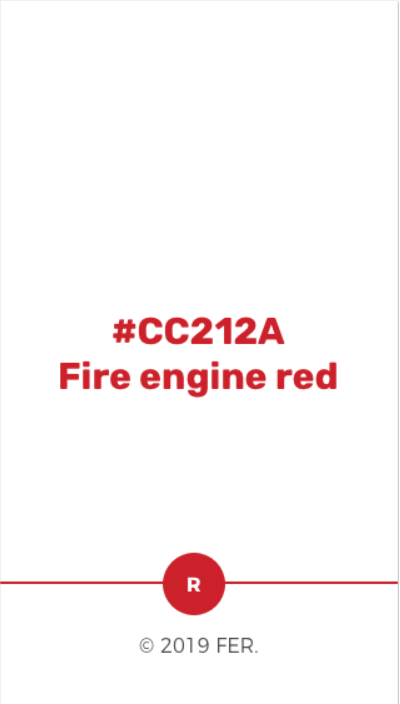
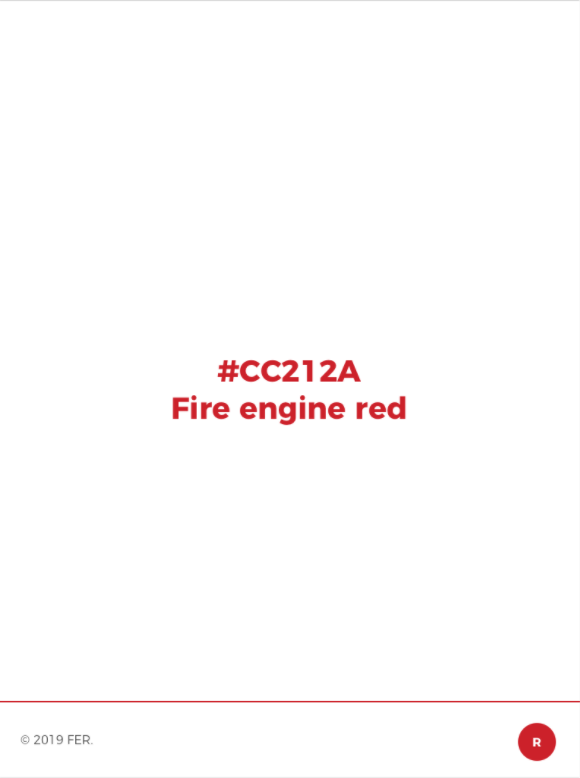

# Intermediate-review serves as Smyle VT landing page 😎

This is one of the first exercises to review our progress in _Module 1 at Adalab´s bootcamp_.

## The most perfect red of the year

The municipal fire service are going to launch an online campaign.
The first step of this campaign is to make the public aware of the most perfect red there is, which is also the corporate colour of the proud fire service: Fire Red Engine.
We have been asked to make a **simple landing page** to present Fire Engine Red. 
The design service of the city council has prepared some screens, and we are going to do the responsive layout.

The minimalist style is made up of:

1. a **body** occupyng the **total height of the screen**, 
2. the hexadecimal code (#CC212A) in the middle, and the most perfect red name, the Fire Red Engine. Of course, using this colour for the font and contrasting with the purest digital white,
3. a **fixed footer** to the browser window showing what will be the future branding of that colour.

The design is **responsive** to mobile, tablet and desktop.  
In addition to that, I have implemented a **link** 🔗 to his **Youtube channel**, could you find it out?👀

## The screens

Mobile version 📱:

Tablet and desktop version 💻:

---

To develop this first prototype I used the **knowledge** acquired in the first 2 weeks of the course. 💪

### Summary:

